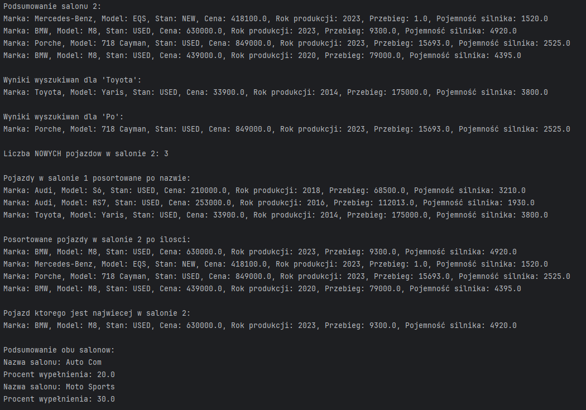
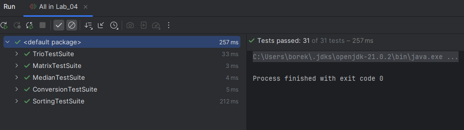
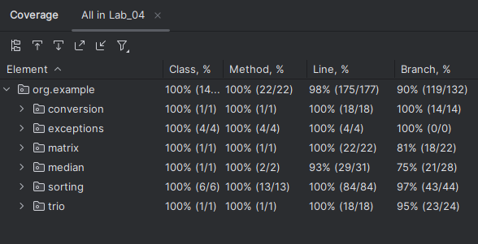
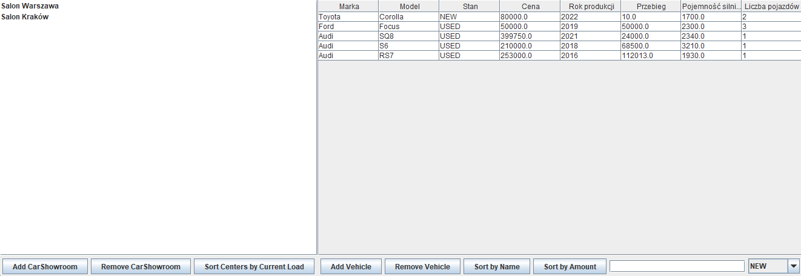
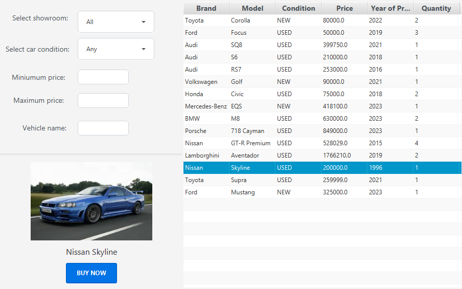

# Programming of Functional Applications

This repository contains projects developed for the "Programming of Functional Applications" course during the fourth semester at my university. The assignments are organized into directories labeled `Lab_XX`, where `XX` represents the lab number.

## Projects Overview

Below is a brief overview of the projects:

- **Lab_01 to Lab_10**: Each folder contains a distinct project developed as part of the coursework. Initially, projects were implemented using Java Swing, and later transitioned to JavaFX for enhanced functionality and user interfaces.

## Technologies Used

- **Java**: Primary programming language for all projects.
- **Swing**: Utilized in early projects for building graphical user interfaces.
- **JavaFX**: Adopted in later projects to create more sophisticated and modern user interfaces.

## Getting Started

To explore or run any of the projects:

1. **Clone the Repository**:

   ```bash
   git clone https://github.com/Frigzer/Programming-of-functional-applications.git
   ```
   
2. **Navigate to the Desired Lab Directory**:

   ```bash
   cd Programming-of-functional-applications/Lab_XX
   ```

3. **Build and Run**:

   - Open the project in your preferred Java IDE (e.g., IntelliJ IDEA, Eclipse).
   - Ensure the necessary libraries (Swing or JavaFX) are configured.
   - Build and run the project as per the IDE's guidelines.

## Lab_01: Introduction to Java

**Description**:  
This initial lab focuses on familiarizing with Java basics. The task involves creating a simple console application where the user selects a geometric shape by entering a number. Depending on the chosen shape, the program prompts for the necessary dimensions (e.g., side lengths) and then calculates and displays the area and perimeter.

---

### 💡 Features

- Console-based user interface
- Shape selection via numeric input
- Area and perimeter calculation for:
  - Square
  - Rectangle
  - Triangle
  - Circle
  - Prism (3D object)
- Uses object-oriented principles (abstract class, interface)

---

### 📁 Project Structure

```
📦Lab_01/
 ┣ 📂.idea/
 ┃ ┣ 📜.gitignore
 ┃ ┣ 📜misc.xml
 ┃ ┣ 📜modules.xml
 ┃ ┗ 📜workspace.xml
 ┣ 📂out/
 ┃ ┗ 📂production/
 ┃   ┗ 📂Lab_01/
 ┃     ┣ 🧮Circle.class
 ┃     ┣ 🧮Figure.class
 ┃     ┣ 🧮Main.class
 ┃     ┣ 🧮Printable.class
 ┃     ┣ 🧮Prism.class
 ┃     ┣ 🧮Square.class
 ┃     ┗ 🧮Triangle.class
 ┣ 📂src/
 ┃ ┣ 📜Circle.java
 ┃ ┣ 📜Figure.java
 ┃ ┣ 📜Main.java
 ┃ ┣ 📜Printable.java
 ┃ ┣ 📜Prism.java
 ┃ ┣ 📜Square.java
 ┃ ┗ 📜Triangle.java
 ┣ 📜.gitignore
 ┣ 📜Lab_01.iml  
```

---

### 📸 Screenshot


---

## Lab_02: Car Showroom System (Console Application)

**Description**:  
In this lab, the goal was to create the foundation for a car showroom management system using Java.  
The application runs in the terminal and allows users to simulate adding, removing, searching, and managing vehicles within multiple car showrooms.

The lab introduces the use of collections, comparators, enums, and more advanced OOP concepts like containers and data management logic.

---

### 💡 Features

- Multiple car showrooms (`CarShowroomContainer`)
- Adding and removing vehicles
- Searching vehicles by exact or partial name
- Counting vehicles by condition (`NEW`, `USED`)
- Sorting by name or amount available
- Finding the most available vehicle
- Detecting and removing empty showrooms

---

### 📁 Project Structure

```
📦Lab_02/
 ┣ 📂.idea/
 ┃ ┣ 📜.gitignore
 ┃ ┣ 📜misc.xml
 ┃ ┣ 📜modules.xml
 ┃ ┗ 📜workspace.xml
 ┣ 📂out/
 ┃ ┗ 📂production/
 ┃   ┗ 📂Lab_02/
 ┃     ┣ 🧮CarShowroom$AmountComparator.class
 ┃     ┣ 🧮CarShowroom.class
 ┃     ┣ 🧮CarShowroomContainer.class
 ┃     ┣ 🧮ItemCondition.class
 ┃     ┣ 🧮Main.class
 ┃     ┗ 🧮Vehicle.class
 ┣ 📂src/
 ┃ ┣ 📜CarShowroom.java
 ┃ ┣ 📜CarShowroomContainer.java
 ┃ ┣ 📜ItemCondition.java
 ┃ ┣ 📜Main.java
 ┃ ┗ 📜Vehicle.java
 ┣ 📜.gitignore
 ┣ 📜Lab_02.iml
 ```

### 📸 Screenshot



### 📦 Class Overview

---

#### 🏷️ `ItemCondition` (enum)

Defines possible conditions for a vehicle.

**Values**:
- `NEW` – the vehicle is brand new
- `USED` – the vehicle has been previously owned
- `DAMAGED` – the vehicle is not in full working order

> This enum is used by `Vehicle` and referenced in filtering and counting operations throughout the system.

---

#### 🚗 `Vehicle`

Represents a single car model stored in a showroom.  
This class implements the `Comparable` interface and can be sorted by brand name.

**Fields**:
- `brand` – brand of the vehicle (e.g., BMW, Toyota)
- `model` – specific model (e.g., M8, Yaris)
- `condition` – vehicle condition, defined by `ItemCondition` enum (`NEW`, `USED`)
- `price` – price in local currency
- `yearOfProduction` – production year
- `mileage` – current mileage (in km)
- `engineCapacity` – engine displacement (in cm³)
- `quantity` – number of available units (default: 1)

**Methods**:
- `print()` – prints all vehicle details to the console
- `compareTo(Vehicle o)` – compares vehicles by brand (alphabetical order)
- `getCondition()` – returns the vehicle's condition
- `getAmount()` – returns the current quantity available

---

#### 🏢 `CarShowroom`

Represents a single car showroom that holds a collection of vehicles.  
Provides methods for managing, searching, and sorting vehicles. Handles capacity limits and vehicle quantities.

**Fields**:
- `showroomName` – the name of the showroom (e.g., "Auto Com")
- `cars` – list of vehicles stored in the showroom
- `maxCapacity` – maximum number of unique vehicle entries allowed

**Constructor**:
- `CarShowroom(String showroomName, int maxCapacity)` – initializes the showroom with a name and capacity

**Methods**:

- `addProduct(Vehicle vehicle)`  
  Adds a vehicle to the showroom. If the vehicle already exists, increments its quantity. Rejects addition if the showroom is full.

- `getProduct(Vehicle vehicle)`  
  Retrieves one unit of a vehicle (decrements quantity). Removes it if quantity reaches zero.

- `removeProduct(Vehicle vehicle)`  
  Removes the vehicle from the showroom regardless of quantity.

- `search(String name)`  
  Finds a vehicle by full brand and model name (exact match).

- `searchPartial(String name)`  
  Returns a list of vehicles whose brand or model contains the given substring.

- `countByCondition(ItemCondition condition)`  
  Counts how many vehicles in the showroom have a specific condition (`NEW` or `USED`).

- `summary()`  
  Prints a summary of all vehicles currently in the showroom.

- `sortByName()`  
  Sorts the vehicle list alphabetically by brand name.

- `sortByAmount()`  
  Sorts the vehicle list by descending quantity using a custom comparator.

- `max()`  
  Returns the vehicle with the highest quantity in the showroom.

- `isEmpty()`  
  Checks whether the showroom contains any vehicles.

- `getFillPercentage()`  
  Returns how full the showroom is, as a percentage of its maximum capacity.

**Inner Class**:
- `AmountComparator`  
  Custom comparator that compares two vehicles by quantity (descending).

---

#### 🗃️ `CarShowroomContainer`

Acts as a manager for multiple car showrooms.  
Internally uses a `HashMap` to map showroom names to `CarShowroom` objects.

**Fields**:
- `carShowrooms` – a map of all car showrooms, keyed by name

**Methods**:

- `addCenter(String name, int maxCapacity)`  
  Adds a new showroom with the given name and capacity.

- `removeCenter(String name)`  
  Removes a showroom by name.

- `findEmpty()`  
  Returns a list of all empty showrooms and prints their names to the console.

- `summary()`  
  Prints the name and fill percentage of every showroom in the system.

- `getShowroom(String name)`  
  Returns the showroom associated with the given name.

---

## Lab_03: Unit Testing and Sorting Algorithms

**Description**:  
This lab focuses on implementing and testing various classic sorting algorithms using the **Strategy design pattern**.  
The sorting strategies are encapsulated as separate classes, allowing them to be easily swapped during runtime.  
Each algorithm is tested against three data sets: pessimistic (reversed), optimistic (already sorted), and expected (random).

---

### 📂 Package: `sorting`

#### 🔄 `SortingStrategy` (interface) 
Defines a common interface for all sorting algorithms:
```java
void sort(int[] arr);
```
📥 `BubbleSort`, `InsertionSort`, `SelectionSort`, `QuickSort`, `MergeSort`

Each class implements `SortingStrategy` and provides its own algorithm.

- `BubbleSort`: Basic, inefficient, optimized with early exit
- `InsertionSort`: Shifts elements into position
- `SelectionSort`: Finds the smallest element each pass
- `QuickSort`: Divide-and-conquer using partitioning
- `MergeSort`: Recursive, stable merge-based sorting

⚙️ `SortingContext`

A context class for executing sorting strategies.
Measures execution time and allows dynamic switching of the algorithm via setStrategy().

```java
SortingContext context = new SortingContext(new BubbleSort());
context.executeStrategy(array);
```

Throws `EmptyArrayException` if the array is empty.

🧪 `SortingTest`

Test suite that runs all sorting strategies on:

- Pessimistic data (reverse sorted)
- Optimistic data (already sorted)
- Expected data (random)

Prints sorting time (in milliseconds) for each case.

---

### ✅ Key Concepts Used

- Strategy Pattern
- Performance testing via `System.nanoTime()`
- Copying arrays for fair comparisons
- Custom exceptions for validation

### 📁 Sorting Package Structure

```
📂sorting/
 ┣ 📜BubbleSort.java
 ┣ 📜InsertionSort.java
 ┣ 📜SelectionSort.java
 ┣ 📜QuickSort.java
 ┣ 📜MergeSort.java
 ┣ 📜SortingStrategy.java
 ┣ 📜SortingContext.java
 ┗ 📜SortingTest.java
```

---

### 📂 Package: `median`

This module implements an efficient solution for finding the **median of two sorted arrays**.  
It includes input validation, custom exception handling, and a test class demonstrating different scenarios.

#### 📊 `MedianCalculator`

Calculates the median of two sorted arrays using **binary search partitioning** (optimized O(log(min(n, m))) time complexity).

**Key method**:
- `double findMedian(int[] num1, int[] num2)`  
  - Validates that both arrays are sorted  
  - Uses partitioning to find the median in logarithmic time  
  - Throws `ArrayNotSortedException` if input arrays are unsorted

**Helper method**:
- `isSorted(int[])` – checks whether an array is sorted in ascending order

> Implements the **"Median of Two Sorted Arrays"** algorithm used in competitive programming and interviews.

---

#### 🧪 `MedianTest`

- Demonstrates the usage of `MedianCalculator` with example arrays  
- Prints results of the median operation  
- Handles and displays exceptions for unsorted input

Example output:

```yaml
[1, 3, 6, 7] + [3, 4, 5] -> 4.0
[1, 2, 6] + [3, 4, 5, 9] -> 4.0
```

---

### 📁 Median Package Structure

```
📂median/
 ┣ 📜MedianCalculator.java
 ┣ 📜MedianTest.java
```

---

### 📂 Package: `matrix`

This module implements a transformation of a 2D matrix into a **spiral-ordered list**.  
It also includes input validation and test cases to showcase the spiral output for different matrix sizes.

#### 🌀 `SpiralMatrix`

Contains logic to traverse a matrix in **spiral order**, starting from the top-left corner and moving inward.

**Key method**:
- `List<Integer> makeSpiral(int[][] matrix)`  
  - Returns the matrix values in a spiral traversal order  
  - Throws `InvalidMatrixException` if the input is empty or malformed  
  - Supports rectangular and square matrices

> Traversal order is: left column → bottom row → right column (in reverse) → top row (in reverse), repeated.

---

#### 🧪 `MatrixTest`

Demonstrates spiral conversion of two example matrices:

- A tall 6×3 matrix  
- A square 4×4 matrix

Prints the original matrix and resulting spiral list.  
Catches and displays exceptions for invalid input.

---

### 📁 Matrix Package Structure

```
📂matrix/
 ┣ 📜SpiralMatrix.java
 ┣ 📜MatrixTest.java
```

---

### 📂 Package: `conversion`

This module implements a **ZigZag text conversion** algorithm, inspired by the classic programming problem "Zigzag Conversion" (e.g., LeetCode 6).  
The algorithm rearranges characters from a given string into a zigzag pattern across multiple rows and then reads them row by row.

#### 🔀 `ZigzagConversion`

Performs the core ZigZag conversion logic.

**Key method**:
- `String convert(String s, int numRows)`  
  - Converts the input string into a ZigZag pattern using the given number of rows  
  - Throws `InvalidNumOfRowsException` if the number of rows is invalid (≤ 1 or ≥ string length)

**Example**:

For input `"PAYPALISHIRING"` and `numRows = 3`, output will be:

```yaml
PAHNAPLSIIGYIR

Pattern:
P A H N
A P L S I I G
Y I R
```

#### 🧪 `ConversionTest`

- Demonstrates ZigZag conversion on two test cases  
- Catches and displays error messages for invalid row numbers  
- Sample output:

```yaml
PAYPALISHIRING po konwersji dla 3 rzędów: PAHNAPLSIIGYIR
PAYPALISHIRING po konwersji dla 4 rzędów: PINALSIGYAHRPI
```

---

### 📁 Conversion Package Structure

```
📂conversion/
 ┣ 📜ZigzagConversion.java
 ┣ 📜ConversionTest.java
```

---

### 📂 Package: `trio`

This module solves the **3Sum problem** – finding all unique triplets in an array that sum up to zero.  
The algorithm is optimized to skip duplicates and avoid redundant combinations.

#### 🔍 `TrioFinder`

Finds all unique triplets `(a, b, c)` in an array such that `a + b + c = 0`.

**Key method**:
- `List<List<Integer>> findTriplet(int[] nums)`  
  - Sorts the input array  
  - Uses a two-pointer approach to find pairs for each element  
  - Skips duplicate values  
  - Throws `EmptyArrayException` if the input is empty

**Algorithm complexity**:  
Time – O(n²) after sorting;  
Space – O(n) for result storage

---

#### 🧪 `TrioTest`

- Runs `TrioFinder` on different integer arrays  
- Outputs all triplets found  
- Handles empty array exception

**Example output**:

```yaml
[0, 4, -5, 1, 0, -1, 9, -4] -> [[-5, 0, 5], [-4, 0, 4], [-1, 0, 1]] [-1, 1, -1, 1, 0, 0, 0] -> [[-1, 0, 1], [0, 0, 0]] [0, 0, 0] -> [[0, 0, 0]]
```

---

### 📁 Trio Package Structure

```
📂trio/
 ┣ 📜TrioFinder.java
 ┣ 📜TrioTest.java
```

---

### 📂 Package: `exceptions`

This package contains **custom exception classes** used throughout other modules to improve code clarity and error handling.

Each exception extends the base `Exception` class and takes a message as a parameter.

#### ❌ `ArrayNotSortedException`  
Thrown when a method expects a sorted array but receives an unsorted one.  
Used in: `median.MedianCalculator`

#### ❌ `EmptyArrayException`  
Thrown when an algorithm receives an empty array and cannot proceed.  
Used in: `sorting.SortingContext`, `trio.TrioFinder`

#### ❌ `InvalidMatrixException`  
Thrown when a matrix is `null`, empty, or has invalid dimensions.  
Used in: `matrix.SpiralMatrix`

#### ❌ `InvalidNumOfRowsException`  
Thrown when the number of rows for ZigZag conversion is not within a valid range.  
Used in: `conversion.ZigzagConversion`

---

### 📁 Exceptions Package Structure

```
📂exceptions/
 ┣ 📜ArrayNotSortedException.java
 ┣ 📜EmptyArrayException.java
 ┣ 📜InvalidMatrixException.java
 ┣ 📜InvalidNumOfRowsException.java
```

---

## Lab_04: Modular Project Structure & Unit Testing (JUnit)

**Description**:  
In this lab, previous implementations from Lab_03 were refactored into a **Maven-based project** using a standard directory layout.  
Test classes were extracted and reorganized into corresponding test suites under `src/test/java`.  
This project follows proper packaging, dependency management (`pom.xml`), and separation of concerns between application logic and testing.

**Key improvements over Lab_03**:
- 📦 Maven project structure: `src/main/java` and `src/test/java`
- 🧪 Centralized test suites for each functional module
- 🔧 Use of `pom.xml` for project configuration
- ✅ Clear separation between test code and application code
- 💡 Improved maintainability and scalability of the codebase

---

### 🗂️ Project Directory Structure

```
📦Lab_04/
 ┣ 📜pom.xml
 ┣ 📂src/
 ┃ ┣ 📂main/ 
 ┃ ┃ ┗ 📂java/org/example/ 
 ┃ ┃ ┣ 📜Main.java 
 ┃ ┃ ┣ 📂conversion/ → ZigzagConversion.java 
 ┃ ┃ ┣ 📂exceptions/ → Custom exception classes 
 ┃ ┃ ┣ 📂matrix/ → SpiralMatrix.java 
 ┃ ┃ ┣ 📂median/ → MedianCalculator.java 
 ┃ ┃ ┣ 📂sorting/ → All sorting algorithms + context 
 ┃ ┃ ┗ 📂trio/ → TrioFinder.java 
 ┃ ┗ 📂test/ ┃ ┗ 📂java/org/example/ 
 ┃ ┣ 📂conversion/ → ConversionTestSuite.java 
 ┃ ┣ 📂exceptions/ → Tests for exceptions 
 ┃ ┣ 📂matrix/ → MatrixTestSuite.java 
 ┃ ┣ 📂median/ → MedianTestSuite.java 
 ┃ ┣ 📂sorting/ → SortingTestSuite.java 
 ┃ ┗ 📂trio/ → TrioTestSuite.java
 ```

### 📸 Screenshots





---

### 📂 Test Package: `org.example.sorting`

This test suite validates the correctness, performance, and exception handling of all sorting algorithms implemented in the application.  
It uses **JUnit 5** and follows a structured `@Test`-based approach within the `SortingTestSuite` class.

#### ✅ `SortingTestSuite`

Covers:

- ✔️ **Correctness** – Each algorithm (Bubble, Insertion, Merge, Quick, Selection) is tested against a known shuffled array and compared to the expected sorted result
- ⚡ **Performance** – Uses `SortingContext` to measure execution time (in ms) on random arrays of 10,000 integers, with assertions ensuring they meet expected performance thresholds
- 🚨 **Exception handling** – Confirms that `EmptyArrayException` is properly thrown on empty input

**Key tests**:
- `testBubbleSort()` through `testSelectionSort()` – correctness tests for each algorithm
- `test<Algo>ExecutionTime()` – ensures sorting completes within a specific time window
- `testSortingExceptionHandling()` – verifies exception is thrown for empty array input

> Example assertion:
```java
assertEquals(Arrays.toString(expected), Arrays.toString(result));
```

> Example performance check:
```java
assertTrue(context.executeStrategy(arr) < 40);
```

---

### 🧪 Technologies used
- JUnit 5
- Randomized input for expected-case testing
- Assertions for both output comparison and runtime bounds

---

### 📁 Sorting Test Structure

```
📂org.example.sorting/
 ┗ 📜SortingTestSuite.java
```

---

### 📂 Test Package: `org.example.trio`

This suite tests the `TrioFinder` class, which finds all unique triplets in an array that sum up to zero.

#### 🔍 `TrioTestSuite`

Covers the following:

- ✅ **Correctness** – verifies that the algorithm returns the correct triplet combinations in various input arrays
- 🚨 **Exception handling** – ensures that an `EmptyArrayException` is thrown when input is empty

**Key tests**:

- `testTrioFinder1()` – finds multiple valid triplets including negative and duplicate numbers
- `testTrioFinder2()` – includes zero and duplicates
- `testTrioFinder3()` – checks for an edge case: `[0, 0, 0]`
- `testTrioExceptionHandling()` – checks proper exception on empty input

> Example assertion:
```java
assertEquals(List.of(List.of(-1, 0, 1), List.of(0, 0, 0)), trio.findTriplet(nums2));
```

### 📁 Trio Test Structure

```
📂org.example.trio/
 ┗ 📜TrioTestSuite.java
```

--- 

### 📂 Test Package: `org.example.median`

This suite tests the `MedianCalculator` class, which implements an efficient algorithm to find the **median of two sorted arrays**.

#### 📊 `MedianTestSuite`

Covers:

- ✅ **Correctness** – tests median calculation across various array lengths (even/odd combined sizes)
- ⚖️ **Balanced vs unbalanced datasets** – includes cases with uneven array sizes
- 🚨 **Exception handling** – ensures `ArrayNotSortedException` is thrown when either input array is not sorted

**Key tests**:

- `testFindMedian1()` to `testFindMedian6()` – verify correct medians for various input arrays
- `testMedianExceptionHandling()` – ensures the calculator throws an exception when unsorted input is provided

> Example assertion:
```java
assertEquals(4.0, medianFinder.findMedian(num1, num2));
```

> Example exception test:

```java
assertThrows(ArrayNotSortedException.class, () -> medianFinder.findMedian(num1, num2));
```

---

### 📁 Median Test Structure

```
📂org.example.median/
 ┗ 📜MedianTestSuite.java
```

---

### 📂 Test Package: `org.example.matrix`

This suite tests the `SpiralMatrix` class, which transforms a 2D matrix into a list of values in **spiral order**.

#### 🌀 `MatrixTestSuite`

Covers:

- ✅ **Correctness** – tests correct spiral output for rectangular (6x3) and square (4x4) matrices
- 🚨 **Exception handling** – ensures that `InvalidMatrixException` is thrown when the input matrix is empty or malformed

**Key tests**:

- `makeSpiralTest1()` – tests spiral traversal of a tall matrix  
- `makeSpiralTest2()` – tests spiral traversal of a 4×4 matrix  
- `testMatrixExceptionHandling()` – tests handling of an invalid (empty) matrix

> Example assertion:
```java
assertEquals(List.of(1, 4, 7, ...), spiralMatrix.makeSpiral(matrix1));
```

---

### 📁 Matrix Test Structure

```
📂org.example.matrix/
 ┗ 📜MatrixTestSuite.java
```

---

### 📂 Test Package: `org.example.conversion`

This suite tests the `ZigzagConversion` class, which converts a string into a **zigzag pattern** across a given number of rows, then reads it row by row.

#### 🔁 `ConversionTestSuite`

Covers:

- ✅ **Correctness** – verifies the zigzag conversion for typical string + row combinations
- 🚨 **Exception handling** – ensures that an `InvalidNumOfRowsException` is thrown when the number of rows is:
  - Zero
  - One
  - Equal to or greater than the string length

**Key tests**:

- `convertTest1()` – "PAYPALISHIRING", 3 rows → `PAHNAPLSIIGYIR`
- `convertTest2()` – "PAYPALISHIRING", 4 rows → `PINALSIGYAHRPI`
- `testConversionExceptionHandling1()` to `4()` – invalid `numRows` cases

> Example assertion:
```java
assertEquals("PAHNAPLSIIGYIR", converter.convert("PAYPALISHIRING", 3));
```

> Example exception test:
```java
assertThrows(InvalidNumOfRowsException.class, () -> converter.convert("ABGR", 6));
```

---

### 📁 Conversion Test Structure

```java
📂org.example.conversion/
 ┗ 📜ConversionTestSuite.java
```

---

### 📂 Package: `org.example.exceptions`

This package defines **custom exceptions** used throughout the application modules to provide clear and meaningful error reporting.

All classes extend the base Java `Exception` class and accept a message upon construction.

#### ❌ Custom Exceptions:

- **`ArrayNotSortedException`**  
  Thrown when median calculation receives unsorted arrays.  
  Used in: `MedianCalculator`, `MedianTestSuite`

- **`EmptyArrayException`**  
  Thrown when an algorithm receives an empty array.  
  Used in: `SortingContext`, `TrioFinder`

- **`InvalidMatrixException`**  
  Thrown when a matrix is null, empty, or invalid for spiral traversal.  
  Used in: `SpiralMatrix`

- **`InvalidNumOfRowsException`**  
  Thrown when an invalid row count is used in ZigZag conversion.  
  Used in: `ZigzagConversion`

> Each of these exceptions is tested indirectly in their respective module test suites by checking exception handling behavior.

---

### 📁 Exceptions Package Structure

```
📂org.example.exceptions/ 
 ┣ 📜ArrayNotSortedException.java 
 ┣ 📜EmptyArrayException.java 
 ┣ 📜InvalidMatrixException.java 
 ┗ 📜InvalidNumOfRowsException.java
```

---

## Lab_05: Car Showroom – Swing GUI Application

**Description**:  
This lab introduces a **desktop-based showroom manager** written in Java using **Swing**.  
It allows an administrator to create showrooms and add vehicles to them via a graphical interface.  
The app builds upon earlier console-based logic but moves it into an interactive, windowed environment.

---

### 🖼️ Screenshot



---

### 🧩 Features

- ➕ Add and remove vehicles from a showroom  
- 🏢 Create and delete car showrooms  
- 🔍 Filter vehicles by brand or condition  
- ↕️ Sort vehicles by name or available quantity  
- 🧾 Summary display of current vehicles  
- 🗂️ Vehicle data stored in memory (initialized in code – no database)

---

### 🚀 How to Run

#### Using IntelliJ
1. Open the project in IntelliJ
2. Locate `org.example.Main`
3. Run it directly – GUI will launch

---

### 📁 Simplified Project Structure

```
📦Lab_05/
 ┣ 📂core/         → Logic layer (Vehicle, Showroom, Condition enum)
 ┣ 📂gui/          → GUI components (main window, panels)
 ┣ 📂models/       → TableModel for GUI table
 ┣ 📜Main.java     → Launches the application
 ┣ 📜pom.xml       → Maven configuration
```
---

## Lab_06: Car Showroom – JavaFX Client Application

**Description**:  
This lab transforms the showroom manager into a **user-facing GUI application** using **JavaFX**.  
It acts as a *client interface*, allowing users to browse available vehicles, view images, and simulate purchases.  
Unlike previous labs, this app does **not** allow adding new vehicles or showrooms – it works on pre-defined data.

---

### 🖼️ Screenshot



---

### 🧩 Features

- 🏎️ Browse available showrooms and vehicles
- 🖼️ View image previews of selected vehicles
- 🛒 Purchase a vehicle (removes it from inventory)
- 🎛️ Filter or sort vehicles by brand, condition, etc.
- 🎨 Styled using CSS + JavaFX components
- 💾 Vehicle and showroom data are predefined in code

> This app simulates a client-side showroom browser, separated from administrative logic.

---

### 🚀 How to Run

#### IntelliJ IDEA
1. Open the project
2. Run `org.example.lab_06.CarShowroomApp`

> ✅ Requires JavaFX (included via Maven)\
> 📦 Uses FXML for layout and CSS for styling

---

### 📁 Simplified Project Structure

```
📦Lab_06/
 ┣ 📂core/         → Data layer (Vehicle, Showroom, Condition enum)
 ┣ 📂gui/          → JavaFX controllers and main app class
 ┣ 📂resources/
 ┃ ┣ 📜CarShowroom-view.fxml
 ┃ ┣ 📜style.css
 ┃ ┣ 📜title.jpg
 ┃ ┗ 📂carImages/  → Car images shown in the app
 ┣ 📜pom.xml       → Maven config (includes JavaFX plugin)
 ┗ 📜module-info.java
```