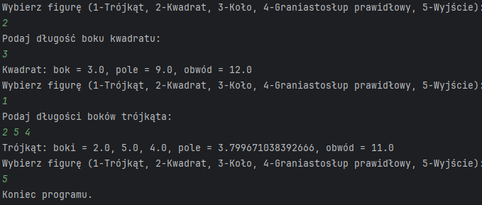

# Programming of Functional Applications

This repository contains projects developed for the "Programming of Functional Applications" course during the fourth semester at my university. The assignments are organized into directories labeled `Lab_XX`, where `XX` represents the lab number.

## Projects Overview

Below is a brief overview of the projects:

- **Lab_01 to Lab_10**: Each folder contains a distinct project developed as part of the coursework. Initially, projects were implemented using Java Swing, and later transitioned to JavaFX for enhanced functionality and user interfaces.

## Technologies Used

- **Java**: Primary programming language for all projects.
- **Swing**: Utilized in early projects for building graphical user interfaces.
- **JavaFX**: Adopted in later projects to create more sophisticated and modern user interfaces.

## Getting Started

To explore or run any of the projects:

1. **Clone the Repository**:

   ```bash
   git clone https://github.com/Frigzer/Programming-of-functional-applications.git
   ```
   
2. **Navigate to the Desired Lab Directory**:

   ```bash
   cd Programming-of-functional-applications/Lab_XX
   ```

3. **Build and Run**:

   - Open the project in your preferred Java IDE (e.g., IntelliJ IDEA, Eclipse).
   - Ensure the necessary libraries (Swing or JavaFX) are configured.
   - Build and run the project as per the IDE's guidelines.

## Lab_01: Introduction to Java

**Description**:  
This initial lab focuses on familiarizing with Java basics. The task involves creating a simple console application where the user selects a geometric shape by entering a number. Depending on the chosen shape, the program prompts for the necessary dimensions (e.g., side lengths) and then calculates and displays the area and perimeter.

---

### 💡 Features

- Console-based user interface
- Shape selection via numeric input
- Area and perimeter calculation for:
  - Square
  - Rectangle
  - Triangle
  - Circle
  - Prism (3D object)
- Uses object-oriented principles (abstract class, interface)

---

### 📁 Project Structure

```
📦Lab_01/
 ┣ 📂.idea/
 ┃ ┣ 📜.gitignore
 ┃ ┣ 📜misc.xml
 ┃ ┣ 📜modules.xml
 ┃ ┗ 📜workspace.xml
 ┣ 📂out/
 ┃ ┗ 📂production/
 ┃   ┗ 📂Lab_01/
 ┃     ┣ 🧮Circle.class
 ┃     ┣ 🧮Figure.class
 ┃     ┣ 🧮Main.class
 ┃     ┣ 🧮Printable.class
 ┃     ┣ 🧮Prism.class
 ┃     ┣ 🧮Square.class
 ┃     ┗ 🧮Triangle.class
 ┣ 📂src/
 ┃ ┣ 📜Circle.java
 ┃ ┣ 📜Figure.java
 ┃ ┣ 📜Main.java
 ┃ ┣ 📜Printable.java
 ┃ ┣ 📜Prism.java
 ┃ ┣ 📜Square.java
 ┃ ┗ 📜Triangle.java
 ┣ 📜.gitignore
 ┣ 📜Lab_01.iml

   
```

---

### 📸 Screenshot



---